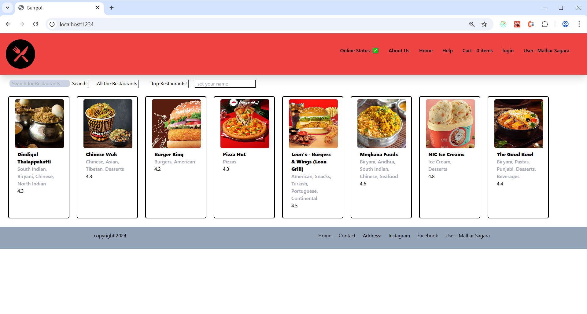
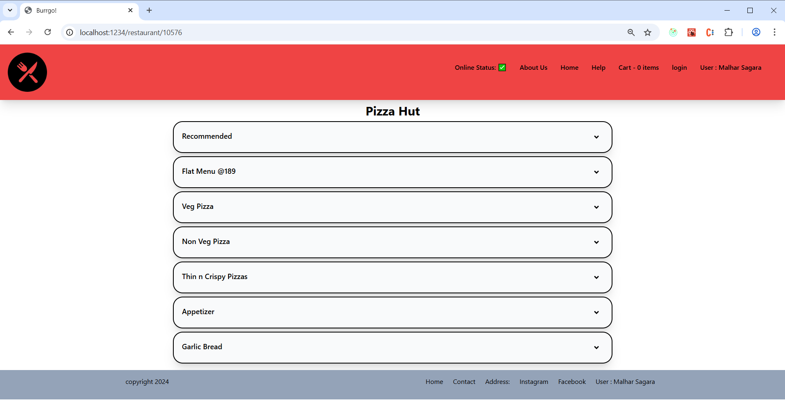
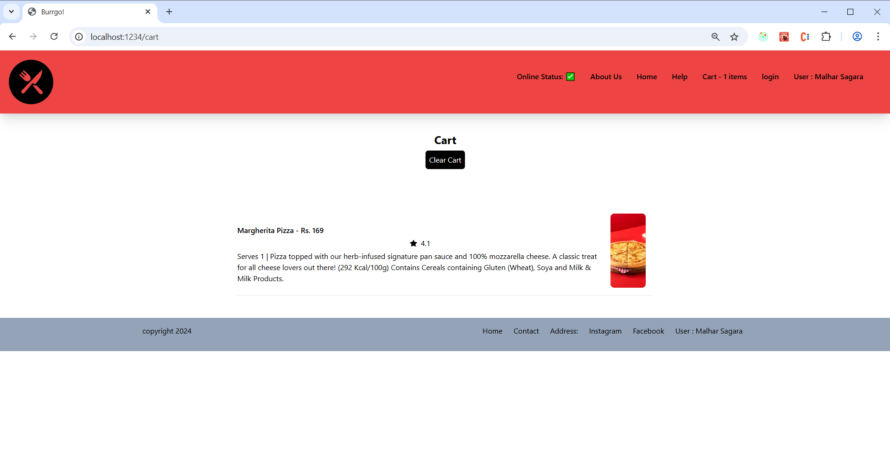

# 🌯 Burrgo – A Swiggy-Inspired Food Delivery UI Clone

Burrgo is a React-based front-end clone of Swiggy's restaurant listing and food ordering experience. It simulates real-world food delivery app functionalities such as browsing restaurants, viewing detailed menus, adding items to cart, and navigating across pages using React Router.

Built with performance and modularity in mind, Burrgo uses Redux Toolkit for state management and TailwindCSS for responsive UI design.

---

## 📸 Screenshots

- ### Home Page
  
- ### Menu Page

- ### Menu Page (Selected)
.png)  
- ### Cart Page


---

## 🚀 Live Demo

> Coming soon on Vercel!

---

## 🔧 Tech Stack

- **React**
- **Redux Toolkit**
- **React Router DOM**
- **TailwindCSS**
- **Parcel** (for bundling)
- **Jest** (for testing)
- **Babel** (for JSX transpilation)

---

## ✨ Features

- ✅ **Restaurant Listing** – Pulled from Swiggy's public API  
- ✅ **Config-Driven UI** – Easy to maintain and update  
- ✅ **Menu Page Navigation** – Dynamic routing with `restaurantId`  
- ✅ **Add to Cart Functionality** – Item-level add/remove logic  
- ✅ **Redux-Based Cart State** – Scalable state management  
- ✅ **Routing with Nested Routes & Outlet**  
- ✅ **Responsive UI** – TailwindCSS-based styling  
- ✅ **Code-Splitting & Performance Optimization**  
- ✅ **Fallback Support** – Local mock data available in case of CORS issues  
- ✅ **Login Toggle** – Basic simulated login/logout toggle

---

## 📁 Folder Structure

src/
│
├── components/ # All UI components
├── pages/ # Page components like Home, Menu, Cart
├── mockData/ # Contains resListMock.json (mock restaurant data)
├── redux/ # Redux Toolkit slices (cart, user, etc.)
├── utils/ # Custom hooks like useRestaurantList
├── constants.js # API endpoints and static config
├── App.js # Route configuration
└── index.js

---

## 🧪 Testing

- Basic test cases using **Jest**.
- More comprehensive tests (e.g., unit + integration) can be added later.

---

## ⚠️ CORS Warning

Swiggy's public APIs are protected by CORS. In development, API calls may fail unless you:

- Use a CORS proxy (temporary workaround, not recommended for production)
- Or switch to local mock JSON data (provided in `src/mockData/resListMock.json`)

Currently, Burrgo uses the **Swiggy API by default**, but you can manually swap it with the mock file if needed.

---

## 🛠️ Installation & Running Locally

```bash
git clone https://github.com/your-username/burrgo.git
cd burrgo
npm install
npm run start
```

🧠 Future Plans
🔐 Full-fledged Login/Auth system

🛍️ Backend integration for order/purchase flow

📱 Progressive Web App (PWA) version

🌍 Filters by cuisine, delivery time, price

🖼️ Lazy loading + skeleton loaders

🙌 Acknowledgements
Inspired by Swiggy.com

Created as a part of a learning project from the Namaste React Course by Akshay Saini

🧑‍💻 Author
Rushabh Bhupendrakumar Sagara
GitHub · LinkedIn
Email: rushabhdev0999@gmail.com

📄 License
This project is for educational purposes only. It is not intended for commercial use or distribution.


